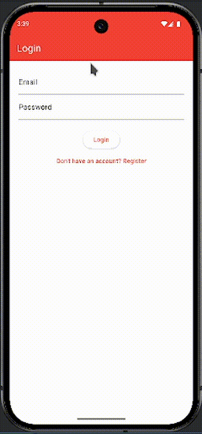

# Todo App Flutter

Este é um aplicativo de gerenciamento de tarefas desenvolvido com Flutter. Ele permite que os usuários realizem o cadastro, login, e gerenciamento de tarefas, além de garantir uma experiência otimizada com recursos como persistência local e sincronização offline.

## Demostração


## 🎯 Desafio
Esse projeto é uma resolução do desafio **[Flutter Task Manager App](https://github.com/seven-tech-solution/flutter-test)**.

## 📋 Funcionalidades

### ✅ Cadastro e Login
- **Cadastro de usuário**: O usuário pode se registrar com seu nome, e-mail e senha.
- **Login**: Autenticação do usuário com e-mail e senha.
- **Logout**: O usuário pode sair da sua conta a qualquer momento.

### ✅ Gerenciamento de Tarefas
- **Criar tarefa**: O usuário pode adicionar novas tarefas com título, descrição e data de criação.
- **Editar tarefa**: O usuário pode editar detalhes de tarefas existentes.
- **Deletar tarefa**: O usuário pode remover tarefas.
- **Marcar tarefas**:
  - **Concluída**: O usuário pode marcar uma tarefa como concluída.
  - **Favorita**: O usuário pode marcar uma tarefa como favorita.

- **Visualizar tarefas**:
  - Todas as tarefas.
  - Apenas as tarefas favoritas.

### ✅ Multiusuário
- **Tarefas vinculadas ao `uid` do usuário no Firebase**: Cada usuário pode visualizar e gerenciar apenas suas próprias tarefas.

### ✅ Diferenciais
- **Persistência local de dados**: Uso de tecnologias como Hive para armazenamento local.
- **Busca por título**: Campo de busca para facilitar a localização de tarefas.
- **Filtros**:
  - Filtrar por tarefas concluídas.
  - Filtrar por tarefas favoritas.
- **Ordenação por data**: Tarefas podem ser ordenadas pela data de criação.
- **Tema Light/Dark**: O aplicativo oferece a opção de alternar entre os modos claro e escuro.
- **Suporte Offline First**: O aplicativo mantém os dados sincronizados em segundo plano, mesmo sem conexão à internet, e os dados são atualizados ao reconectar.
- **Responsividade**: O design do app se adapta a diferentes tamanhos de tela, incluindo smartphones e tablets.

## 🔧 Tecnologias Utilizadas

- **Flutter**: Framework para construção do aplicativo.
- **Firebase Authentication**: Autenticação de usuários.
- **Cloud Firestore**: Banco de dados em tempo real para armazenamento de tarefas.
- **GetX**: Gerenciamento de estado e navegação.

## 📱 Como Rodar

### Pré-requisitos

1. [Instalar o Flutter](https://flutter.dev/docs/get-started/install).
2. Configurar o Firebase no projeto. Para isso, siga as instruções de configuração do Firebase para Android e iOS [aqui](https://firebase.flutter.dev/docs/overview).

### Rodando o Projeto

1. Clone o repositório:

```bash
git clone https://github.com/seu-usuario/flutter-test.git
```

2. Acesse o diretório do projeto:

```bash
cd flutter-test
```

3. Instale as dependências:

```bash
flutter pub get
```

4. Execute o aplicativo:

```bash
flutter run
```

## 📅 Tarefas Futuros

- Implementar notificações para lembrar o usuário de suas tarefas.
- Suporte para múltiplos dispositivos por usuário.
- Adicionar testes unitários e integrados.
